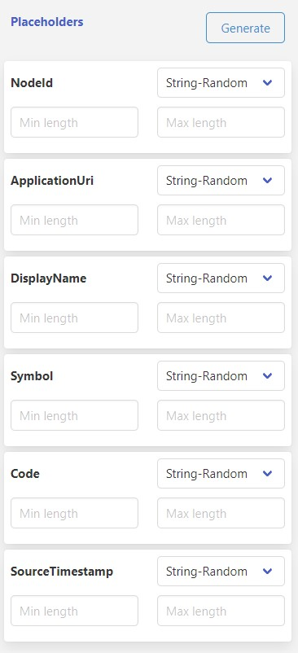

# Date Wave

## **Overview**

The Date Wave application is designed to facilitate the exchange of messages between various applications such as IoT Hub, Event Hub, Service Bus, MQTT, and Kafka. The application is currently capable of sending and receiving messages from these services, and in the future, there may be more services added to the list. This feature can be beneficial during the development process as it allows for basic testing of services and applications

The Date Wave application also enables users to prepare messages using pre-defined templates and send them periodically or at specific time intervals. Additionally, the application can consume messages from the aforementioned services and display them, providing users with a way to view the messages being received by the application. Overall, the Date Wave application is a valuable tool for facilitating message exchange and monitoring during the development process.

---

## **Supported Services**

Please find the supported services below

| Service | Send | Send as Bulk | Receive 
|:---:|:---:|:---:|:---:|
| IoT Hub | ✔️ | ✔️ | ✔️ 
| Event Hub | ✔️ | ✔️ | ✔️ 
| Service Bus | ✔️ | ✔️ | ✔️ 
| MQTT | ✔️ | ⭕️ | ✔️ 
| Kafka | 🔷 | ⭕️ | 🔷 


Please find the supported message functionalities below

| Service | Message body | Message Header | Message Properties 
|:---:|:---:|:---:|:---:|
| IoT Hub | ✔️ | ✔️ | ✔️ 
| Event Hub | ✔️ | ✔️ | ✔️ 
| Service Bus | ✔️ | ✔️ | ✔️ 
| MQTT | ✔️ | ⭕️ | ⭕️
| Kafka | 🔷 | ⭕️ | ⭕️ 

---

✔️ Available &emsp; | &emsp; ⭕️ Not available &emsp; | &emsp; ❌ Not implemented &emsp; | &emsp; 🔷 Coming soon

---

## **Usage Instructions**

*Please find the screenshot below*


To use the application, please follow these steps:

### **Send Message**

1. To send a message, we can follow the steps below, Regarding custom configurations, you can refer the service section below
2. Select the "Direction" of your message, either "Send" or "Receive".
3. Choose the corresponding "Service" for your message. Supported services include Azure IoT Hub, Azure Event Hub, Azure Service Bus, MQTT, and Kafka (coming soon).
4. Provide the necessary "Connection Settings" for your service. These settings will vary based on your chosen direction and service. Please refer to the service-specific settings provided below.
5. For sending a message, provide the required "Publish Settings", which include the message and its associated template, header, header template, properties, and properties template.
6. Optionally, you can replace the placeholders in the provided template by clicking the "Generate" button in the "Placeholders" section. This will generate a list of placeholders that can be filled by choosing the available options.
7. You can preview the message generation by clicking the "Preview" button before publishing.
8. Click the "Start" button to start publishing the messages. Logs will be displayed on the screen.
9. Click the "Stop" button to stop the publishing process.

For receiving a message, follow the same steps 1-3 as for sending. After providing the connection settings, click the "Start" button to begin receiving messages. Logs will be displayed on the screen. Click the "Stop" button to stop the receiving process.

---

## **Settings**

### **Direction**

The "Direction" setting determines whether messages are being sent or received.

*Please find the screenshot below*


| Option | Description 
|---|---|
| Send | Send messages to the service
| Receive | Receive messages from the service

### **Services**

The "Service" setting determines which service to use.

*Please find the screenshot below*


| Option | Description 
|---|---|
| IoT Hub | Azure IoT Hub 
| Event Hub | Azure Event Hub
| Service Bus | Azure Service Bus
| MQTT | MQTT service
| Kafka - Coming Soon| Kafka service  


### **Connection Settings**

The "Connection Settings" will vary based on the chosen direction and service. Please refer to the service-specific settings provided below.

### IoT Hub - Send

| Option | Required | Default | Description 
|---|---|---|---|
Device connection string | Yes | | Azure IoT Hub device connection string.
Connection protocol | No | http | Connection protocol to send the message to IoT Hub. You can choose any option from mqtt, mqttws, amqp, amqpws, or http.

### IoT Hub - Receive

| Option | Required | Default | Description 
|---|---|---|---|
Device connection string | Yes | | Azure IoT Hub device connection string.
Connection protocol | No | http | Connection protocol to receive the message from IoT Hub. You can choose any option from mqtt, mqttws, amqp, amqpws, or http.


### Event Hub - Send

| Option | Required | Default | Description 
|---|---|---|---|
Event hub connection string | Yes | | Event hub connection string.

### Event Hub - Receive

| Option | Required | Default | Description 
|---|---|---|---|
Event hub connection string | Yes | | Event hub connection string.
Consumer group | No | $Default | Consumer group name.
Storage account connection string | No | | Storage account connection string to keep the check point. If not provided, you will receive all the messages available in the consumer group. If provided, you will receive the messages which are not processed.
Storage account container name | No | iot-simulator | Storage account container name. If storage connection is available and container name is not provided, the program will try to create a container with the default name. Make sure the connection trying policy has write access.

### Service Bus - Send

| Option | Required | Default | Description 
|---|---|---|---|
Service bus connection string | Yes | | Service bus connection string.
Topic/Queue name | Yes | | Topic or Queue name to send the message.

### Service Bus - Receive

| Option | Required | Default | Description 
|---|---|---|---|
Service bus connection string | Yes | | Service bus connection string.
Topic/Queue name | Yes | | Topic or Queue name to send the message.
Topic Subscription name | No | | Topic subscriber name, if subscribing to topic instead of queue.

### MQTT - Send

| Option | Required | Default | Description 
|---|---|---|---|
Mqtt connection string | Yes | | Mqtt connection string.
Topic Name | Yes | | Mqtt topic name.
User name | No | | User name to connect to the MQTT server. Should provide both user name and password to use the authenticated connection, else the same will be treated as anonymous connection.
Password | No | | Password to connect to the MQTT server. Should provide both user name and password to use the authenticated connection, else the same will be treated as anonymous connection.


### MQTT - Receive

| Option | Required | Default | Description 
|---|---|---|---|
Mqtt connection string | Yes | | Mqtt connection string.
Topic Name | Yes | |Mqtt topic name.
User name | No | | User name to connect to the MQTT server. Should provide both user name and password to use the authenticated connection, else the same will be treated as anonymous connection.
Password | No | | Password to connect to the MQTT server. Should provide both user name and password to use the authenticated connection, else the same will be treated as anonymous connection.

---


### **Publish Settings**

The Publish Settings section specifies the parameters for publishing messages. There are four options: Batch, Delay, Count, and Bulk Send.

*Please find the screenshot below*


| Option | Required | Default | Description 
|---|---|---|---|
Batch| Yes| 1 | Batch size. This will be the number of messages sent within a batch. If the bulk option is selected, these will be sent as a single batch message if that service supports it. Otherwise, the batch will be sent using the same opened connection and sent one by one.
Delay | Yes | 10 | Delay between a batch of messages. It will be in seconds. Can use 0 to send without any delay.
Count | Yes | 0 | If the value is 0, batch of messages will be sent infinitely. If count is provided, specified number of messages will be sent. Please note that the count applies to the number of messages and not the number of batches.
Bulk Send | Yes | false | Will send the message as bulk if the respective service supports it. Otherwise, individual messages will be sent instead of bulk.

## **Controls**

These controls allow you to run the application:

*Please find the screenshot below*


### **Start**
Click this button to start sending messages.

### **Stop**
Click this button to stop sending messages. If a delay is set, wait for the log to display "Sending Stopped" or "Receiving Stopped" to ensure the process is complete.

### **Preview**
Use this button to preview message generation and validate that messages are generated according to the configuration and expectations.


## **Counters**

These counters display the count of messages sent or received while the application is running:

*Please find the screenshot below*


### **Green**
Displays the count of successfully sent or received messages.

### **Red**
Displays the count of failed messages.

### **Blue**
Displays the total count of messages.


## **Actions**

These actions allow you to perform necessary operations on the application:

*Please find the screenshot below*


### **Save Json**
Saves the current run's JSON file, including all settings and parameters, for future use.

### **Upload Json**
Uploads a saved JSON file to the window and updates settings and parameters accordingly.

### **Reset**
Restarts the window.

### **Hide/View Message**
Hides or shows the message template section of the window. This is useful when receiving messages and you want to see the logs section on the full area. You can optionally drag the right bottom corner of the logs section to resize it according to your needs.


## **Logs**

This section displays the logs from the application, and you can control your logs with the following functionalities:

*Please find the screenshot below*


### **Scroll To bottom**
Click this button to display and scroll to the bottom of the logs.

### **Detailed Logs**
Click this button to display detailed logs.

### **Messages**
Click this button to display message contents.

## **Placeholders**

Placeholders allow you to customize your message templates with custom content when sending data to services. To generate placeholders for all placeholders present in the message/header/properties section, click on the "Generate" button. Make sure to use double curly braces to represent a placeholder in your template.

Here's an example message template:

```
{
  "NodeId": "{{NodeId}}",
  "ApplicationUri": "{{ApplicationUri}}",
  "DisplayName": "{{DisplayName}}",
  "Value": {
    "StatusCode": {
      "Symbol": "{{Symbol}}",
      "Code": "{{Code}}"
    },
    "SourceTimestamp": "{{SourceTimestamp}}"
  }
}
```
After clicking on the generate button, the placeholder section on the right side of the screen will show all the placeholders generated for the placeholders in the template.

```
NodeId
ApplicationUri
DisplayName
Symbol
Code
SourceTimestamp
```
then you can see the section like below generated with all placeholders with string random as the placeholder filling method



You can change the placeholder generation method by selecting the respective option from the dropdown. You can find the available options below.

Once you click on the preview button, you can see how the placeholders will prepare the message for you. Here's an example of the default sample:

```
{
  "NodeId": "LEqRZts4j",
  "ApplicationUri": "h1eTcA",
  "DisplayName": "2eQKT",
  "Value": {
    "StatusCode": {
      "Symbol": "ZojTDysL",
      "Code": "dU5orT4vl"
    },
    "SourceTimestamp": "x5P5aQP"
  }
}

```

## **Placeholder Generation Options**

You can use several functionalities to generate the placeholders. Here are the available options and their descriptions:

### **String - Random**

This option generates a random string using upper and lower alphabets.

| Option | Required | Default | Description 
|---|---|---|---|
| Min length | No | 5 | The minimum length of characters while generating the random string.
| Max length | No | 10 | The maximum length of characters while generating the random string.


### **String - Random List**

This option takes a random string provided from the list. You can provide values with comma separation.

Example: 
```
abc,bcd,cde
```

| Option | Required | Default | Description 
|---|---|---|---|
| List - Comma separated string | Yes |  | A random string from the list will be taken to replace the placeholder.


### **String - Sequence List**

This option takes a string in sequence from the list. You can provide values with comma separation.

Example:
```
abc,bcd,cde
```

| Option | Required | Default | Description 
|---|---|---|---|
| List - Comma separated string | Yes |  | A string from the list will be taken in sequence to replace the placeholder.

### **Integer - Random**

This option generates a random integer.

| Option | Required | Default | Description 
|---|---|---|---|
| Minimum | No | 5 | The minimum number while generating the random integer.
| Maximum | No | 10 | The maximum number while generating the random integer.


### **Integer - Random List**

This option takes a random integer provided from the list. You can provide values with comma separation.

Example: 
```
5,7,12
```

| Option | Required | Default | Description 
|---|---|---|---|
| List - Comma separated integer | Yes |  | A random integer from the list will be taken to replace the placeholder.


### **Integer - Sequence List**

This option takes a integer in sequence from the list. You can provide values with comma separation.

Example:
```
5,7,12
```

| Option | Required | Default | Description 
|---|---|---|---|
| List - Comma separated integer | Yes |  | An integer from the list will be taken in sequence to replace the placeholder.


### **Integer - Step by**

This option takes a integer in sequence  with steps based on your increment value and initial value.

Example:
```
Starts with = 5
Increment by = 3

Result : 5, 8, 11, 14....
```


| Option | Required | Default | Description 
|---|---|---|---|
| Starts with | No | 1 | An integer to start the sequence.
| Increment by | No | 1 | An integer to increment.


### **Double - Random**

This option generates a random decimal number.

| Option | Required | Default | Description 
|---|---|---|---|
| Minimum | No | 5.5 | The minimum number while generating the random decimal number.
| Maximum | No | 10.5 | The maximum number while generating the random decimal number.


### **Double - Random List**

This option takes a random decimal number provided from the list. You can provide values with comma separation.

Example: 
```
5.5, 7.5, 12.5
```

| Option | Required | Default | Description 
|---|---|---|---|
| List - Comma separated double | Yes |  | A random decimal number from the list will be taken to replace the placeholder.


### **Double - Sequence List**

This option takes a decimal number in sequence from the list. You can provide values with comma separation.

Example:
```
5.5, 7.5, 12.5
```

| Option | Required | Default | Description 
|---|---|---|---|
| List - Comma separated double | Yes |  | A decimal number from the list will be taken in sequence to replace the placeholder.


### **Integer - Step by**

This option takes a decimal number in sequence with steps based on your increment value and initial value.

Example:
```
Starts with = 5
Increment by = 3.5

Result : 5, 8.5, 12, 15.5....
```


| Option | Required | Default | Description 
|---|---|---|---|
| Starts with | No | 1.00 | A decimal number to start the sequence.
| Increment by | No | .10 | A decimal number to increment.


### **Boolean - Random**

This option generates a random boolean.


### **Boolean - Sequence List**

This option takes a boolean in sequence from the list. You can provide values with comma separation.

Example:
```
true,true,false
```

| Option | Required | Default | Description 
|---|---|---|---|
| List - Comma separated boolean | Yes |  | A boolean from the list will be taken in sequence to replace the placeholder.


### **Guid**

This option generates a V4 guid.

sample result below

```
ffa1db86-c73f-4e45-852c-4d9f6b37c90f
```

### **Time - in UTC**

This option generates current time in UTC.


| Option | Required | Default | Description 
|---|---|---|---|
| Date format  | No |  | you can provide the date format as per the formats available with [moment.js](https://momentjs.com/docs/#/displaying/).


### **Time - in local**

This option generates current time in local timezone.


| Option | Required | Default | Description 
|---|---|---|---|
| Date format  | No |  | you can provide the date format as per the formats available with [moment.js](https://momentjs.com/docs/#/displaying/).

### **Time - in Epoch**

This option generates current time in Epoch/Unix time.

### **Time - in Epoch Mi": "lliseconds**

This option generates current time in Epoch milliseconds / ticks Format.


### **Message** 

you can provide message content in multiple pasts, some services have headers and properties in message to enhance the message, you can use the relative session to provide those details. make sure that the headers and properties will be a single leveled json.

### **Message Template** 

Here you can provide your static or template based message that will be used to send.

### **Message Header Template** 

Here you can provide your static or template based message header that will be used to send as part of the message. you should provide the header in below format

```
{
  "HeaderNodeId": "{{HeaderNodeId}}",
  "HeaderApplicationUri": "{{ApplicationUri}}",
  "HeaderDisplayName": "HardValue"
}
```

### **Message Properties Template** 

Here you can provide your static or template based message properties that will be used to send as part of the message. you should provide the properties in below format. There are a handful properties available for the services, other that will not give any effect even if you provide them

```
{
  "HeaderNodeId": "{{HeaderNodeId}}",
  "HeaderApplicationUri": "{{ApplicationUri}}",
  "HeaderDisplayName": "HardValue"
}
```


### **External libraries** 

External libraries we are using in our applications

Package Name | Version
|---|---|
| @azure/event-hubs | 5.9.0 |
| @azure/eventhubs-checkpointstore-blob | 1.0.1 |
| @azure/service-bus | 7.8.1 |
| @azure/storage-blob | 12.13.0 |
| async-mqtt | 2.6.3 |
| azure-iot-device | 1.18.1 |
| azure-iot-device-amqp | 1.14.2 |
| azure-iot-device-http | 1.14.1 |
| azure-iot-device-mqtt | 1.16.1 |
| bulma | 0.9.4 |
| chart.js | 4.2.1 |
| chartjs-adapter-moment | 1.0.1 |
| jquery | 3.6.4 |
| kafkajs | 2.2.4 |
| moment | 2.29.4 |
| uuid | 9.0.0 |


### **Releases** 


Release | Date | Changes
|---|---|---|
1.0.0 | | Initial Version