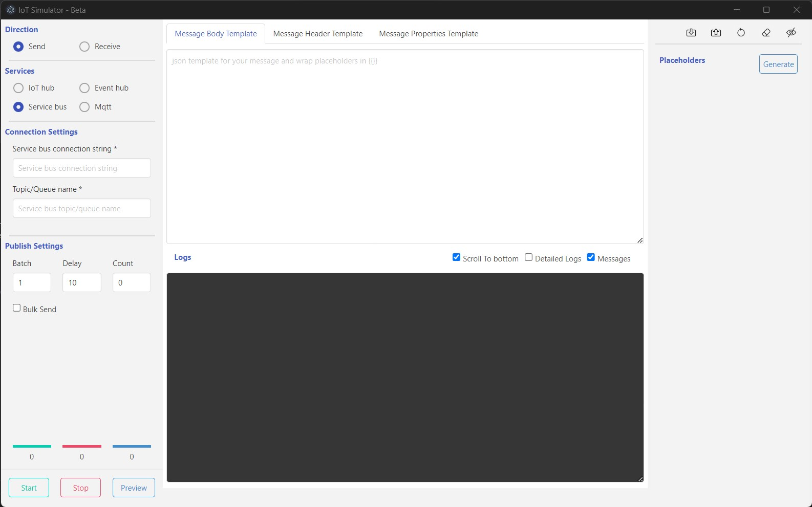

Please find the details about the usage here

*Please find the screenshot below*

To use the application, please follow these steps:

### **Send Message**

1. To send a message, we can follow the steps below, Regarding custom configurations, you can refer the service section below
2. Select the "Direction" of your message, either "Send" or "Receive".
3. Choose the corresponding "Service" for your message. Supported services include Azure IoT Hub, Azure Event Hub, Azure Service Bus, MQTT, and Kafka (coming soon).
4. Provide the necessary "Connection Settings" for your service. These settings will vary based on your chosen direction and service. Please refer to the service-specific settings provided below.
5. For sending a message, provide the required "Publish Settings", which include the message and its associated template, header, header template, properties, and properties template.
6. Optionally, you can replace the placeholders in the provided template by clicking the "Generate" button in the "Placeholders" section. This will generate a list of placeholders that can be filled by choosing the available options.
7. You can preview the message generation by clicking the "Preview" button before publishing.
8. Click the "Start" button to start publishing the messages. Logs will be displayed on the screen.
9. Click the "Stop" button to stop the publishing process.

### **Receive Message**

For receiving a message, follow the same steps 1-3 as for sending. After providing the connection settings, click the "Start" button to begin receiving messages. Logs will be displayed on the screen. Click the "Stop" button to stop the receiving process.
