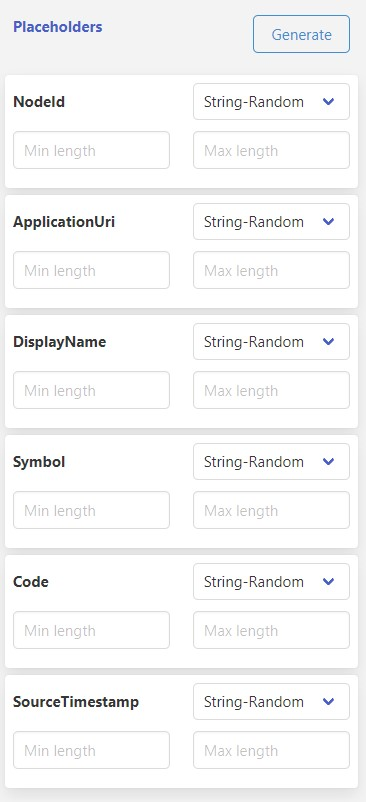

## **Placeholders**

Placeholders allow you to customize your message templates with custom content when sending data to services. To generate placeholders for all placeholders present in the message/header/properties section, click on the "Generate" button. Make sure to use double curly braces to represent a placeholder in your template.

Here's an example message template:

```
{
  "NodeId": "{{NodeId}}",
  "ApplicationUri": "{{ApplicationUri}}",
  "DisplayName": "{{DisplayName}}",
  "Value": {
    "StatusCode": {
      "Symbol": "{{Symbol}}",
      "Code": "{{Code}}"
    },
    "SourceTimestamp": "{{SourceTimestamp}}"
  }
}
```
After clicking on the generate button, the placeholder section on the right side of the screen will show all the placeholders generated for the placeholders in the template.

```
NodeId
ApplicationUri
DisplayName
Symbol
Code
SourceTimestamp
```
then you can see the section like below generated with all placeholders with string random as the placeholder filling method



You can change the placeholder generation method by selecting the respective option from the dropdown. You can find the available options below.

Once you click on the preview button, you can see how the placeholders will prepare the message for you. Here's an example of the default sample:

```
{
  "NodeId": "LEqRZts4j",
  "ApplicationUri": "h1eTcA",
  "DisplayName": "2eQKT",
  "Value": {
    "StatusCode": {
      "Symbol": "ZojTDysL",
      "Code": "dU5orT4vl"
    },
    "SourceTimestamp": "x5P5aQP"
  }
}

```

## **Placeholder Generation Options**

You can use several functionalities to generate the placeholders. Here are the available options and their descriptions:

### **String - Random**

This option generates a random string using upper and lower alphabets.

| Option | Required | Default | Description 
|---|---|---|---|
| Min length | No | 5 | The minimum length of characters while generating the random string.
| Max length | No | 10 | The maximum length of characters while generating the random string.


### **String - Random List**

This option takes a random string provided from the list. You can provide values with comma separation.

Example: 
```
abc,bcd,cde
```

| Option | Required | Default | Description 
|---|---|---|---|
| List - Comma separated string | Yes |  | A random string from the list will be taken to replace the placeholder.


### **String - Sequence List**

This option takes a string in sequence from the list. You can provide values with comma separation.

Example:
```
abc,bcd,cde
```

| Option | Required | Default | Description 
|---|---|---|---|
| List - Comma separated string | Yes |  | A string from the list will be taken in sequence to replace the placeholder.

### **Integer - Random**

This option generates a random integer.

| Option | Required | Default | Description 
|---|---|---|---|
| Minimum | No | 5 | The minimum number while generating the random integer.
| Maximum | No | 10 | The maximum number while generating the random integer.


### **Integer - Random List**

This option takes a random integer provided from the list. You can provide values with comma separation.

Example: 
```
5,7,12
```

| Option | Required | Default | Description 
|---|---|---|---|
| List - Comma separated integer | Yes |  | A random integer from the list will be taken to replace the placeholder.


### **Integer - Sequence List**

This option takes a integer in sequence from the list. You can provide values with comma separation.

Example:
```
5,7,12
```

| Option | Required | Default | Description 
|---|---|---|---|
| List - Comma separated integer | Yes |  | An integer from the list will be taken in sequence to replace the placeholder.


### **Integer - Step by**

This option takes a integer in sequence  with steps based on your increment value and initial value.

Example:
```
Starts with = 5
Increment by = 3

Result : 5, 8, 11, 14....
```


| Option | Required | Default | Description 
|---|---|---|---|
| Starts with | No | 1 | An integer to start the sequence.
| Increment by | No | 1 | An integer to increment.


### **Double - Random**

This option generates a random decimal number.

| Option | Required | Default | Description 
|---|---|---|---|
| Minimum | No | 5.5 | The minimum number while generating the random decimal number.
| Maximum | No | 10.5 | The maximum number while generating the random decimal number.


### **Double - Random List**

This option takes a random decimal number provided from the list. You can provide values with comma separation.

Example: 
```
5.5, 7.5, 12.5
```

| Option | Required | Default | Description 
|---|---|---|---|
| List - Comma separated double | Yes |  | A random decimal number from the list will be taken to replace the placeholder.


### **Double - Sequence List**

This option takes a decimal number in sequence from the list. You can provide values with comma separation.

Example:
```
5.5, 7.5, 12.5
```

| Option | Required | Default | Description 
|---|---|---|---|
| List - Comma separated double | Yes |  | A decimal number from the list will be taken in sequence to replace the placeholder.


### **Integer - Step by**

This option takes a decimal number in sequence with steps based on your increment value and initial value.

Example:
```
Starts with = 5
Increment by = 3.5

Result : 5, 8.5, 12, 15.5....
```


| Option | Required | Default | Description 
|---|---|---|---|
| Starts with | No | 1.00 | A decimal number to start the sequence.
| Increment by | No | .10 | A decimal number to increment.


### **Boolean - Random**

This option generates a random boolean.


### **Boolean - Sequence List**

This option takes a boolean in sequence from the list. You can provide values with comma separation.

Example:
```
true,true,false
```

| Option | Required | Default | Description 
|---|---|---|---|
| List - Comma separated boolean | Yes |  | A boolean from the list will be taken in sequence to replace the placeholder.


### **Guid**

This option generates a V4 guid.

sample result below

```
ffa1db86-c73f-4e45-852c-4d9f6b37c90f
```

### **Time - in UTC**

This option generates current time in UTC.


| Option | Required | Default | Description 
|---|---|---|---|
| Date format  | No |  | you can provide the date format as per the formats available with [moment.js](https://momentjs.com/docs/#/displaying/).


### **Time - in local**

This option generates current time in local timezone.


| Option | Required | Default | Description 
|---|---|---|---|
| Date format  | No |  | you can provide the date format as per the formats available with [moment.js](https://momentjs.com/docs/#/displaying/).

### **Time - in Epoch**

This option generates current time in Epoch/Unix time.

### **Time - in Epoch Mi": "lliseconds**

This option generates current time in Epoch milliseconds / ticks Format.