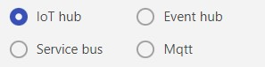
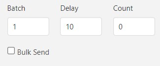

### **Direction**

The "Direction" setting determines whether messages are being sent or received.

*Please find the screenshot below*

| Option | Description 
|---|---|
| Send | Send messages to the service
| Receive | Receive messages from the service

---

### **Services**

The "Service" setting determines which service to use.

*Please find the screenshot below*

| Option | Description 
|---|---|
| IoT Hub | Azure IoT Hub 
| Event Hub | Azure Event Hub
| Service Bus | Azure Service Bus
| MQTT | MQTT service
| Kafka - Coming Soon| Kafka service  

---

### **Connection Settings**

The "Connection Settings" will vary based on the chosen direction and service. Please refer to the service-specific settings provided below.

#### **IoT Hub - Send**

| Option | Required | Default | Description 
|---|---|---|---|
Device connection string | Yes | | Azure IoT Hub device connection string.
Connection protocol | No | http | Connection protocol to send the message to IoT Hub. You can choose any option from mqtt, mqttws, amqp, amqpws, or http.

#### **IoT Hub - Receive**

| Option | Required | Default | Description 
|---|---|---|---|
Device connection string | Yes | | Azure IoT Hub device connection string.
Connection protocol | No | http | Connection protocol to receive the message from IoT Hub. You can choose any option from mqtt, mqttws, amqp, amqpws, or http.

#### **Event Hub - Send**

| Option | Required | Default | Description 
|---|---|---|---|
Event hub connection string | Yes | | Event hub connection string.

#### **Event Hub - Receive**

| Option | Required | Default | Description 
|---|---|---|---|
Event hub connection string | Yes | | Event hub connection string.
Consumer group | No | $Default | Consumer group name.
Storage account connection string | No | | Storage account connection string to keep the check point. If not provided, you will receive all the messages available in the consumer group. If provided, you will receive the messages which are not processed.
Storage account container name | No | iot-simulator | Storage account container name. If storage connection is available and container name is not provided, the program will try to create a container with the default name. Make sure the connection trying policy has write access.

#### **Service Bus - Send**

| Option | Required | Default | Description 
|---|---|---|---|
Service bus connection string | Yes | | Service bus connection string.
Topic/Queue name | Yes | | Topic or Queue name to send the message.

#### **Service Bus - Receive**

| Option | Required | Default | Description 
|---|---|---|---|
Service bus connection string | Yes | | Service bus connection string.
Topic/Queue name | Yes | | Topic or Queue name to send the message.
Topic Subscription name | No | | Topic subscriber name, if subscribing to topic instead of queue.

#### **MQTT - Send**

| Option | Required | Default | Description 
|---|---|---|---|
Mqtt connection string | Yes | | Mqtt connection string.
Topic Name | Yes | | Mqtt topic name.
User name | No | | User name to connect to the MQTT server. Should provide both user name and password to use the authenticated connection, else the same will be treated as anonymous connection.
Password | No | | Password to connect to the MQTT server. Should provide both user name and password to use the authenticated connection, else the same will be treated as anonymous connection.

#### **MQTT - Receive**

| Option | Required | Default | Description 
|---|---|---|---|
Mqtt connection string | Yes | | Mqtt connection string.
Topic Name | Yes | |Mqtt topic name.
User name | No | | User name to connect to the MQTT server. Should provide both user name and password to use the authenticated connection, else the same will be treated as anonymous connection.
Password | No | | Password to connect to the MQTT server. Should provide both user name and password to use the authenticated connection, else the same will be treated as anonymous connection.

---

### **Publish Settings**

The Publish Settings section specifies the parameters for publishing messages. There are four options: Batch, Delay, Count, and Bulk Send.

*Please find the screenshot below*

| Option | Required | Default | Description 
|---|---|---|---|
Batch| Yes| 1 | Batch size. This will be the number of messages sent within a batch. If the bulk option is selected, these will be sent as a single batch message if that service supports it. Otherwise, the batch will be sent using the same opened connection and sent one by one.
Delay | Yes | 10 | Delay between a batch of messages. It will be in seconds. Can use 0 to send without any delay.
Count | Yes | 0 | If the value is 0, batch of messages will be sent infinitely. If count is provided, specified number of messages will be sent. Please note that the count applies to the number of messages and not the number of batches.
Bulk Send | Yes | false | Will send the message as bulk if the respective service supports it. Otherwise, individual messages will be sent instead of bulk.
